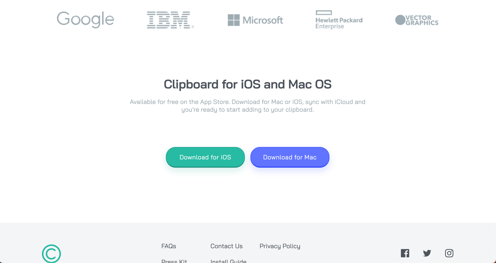

# Frontend Mentor - Clipboard landing page solution

This is a solution to the [Clipboard landing page challenge on Frontend Mentor](https://www.frontendmentor.io/challenges/clipboard-landing-page-5cc9bccd6c4c91111378ecb9). Frontend Mentor challenges help you improve your coding skills by building realistic projects.

## Table of contents

- [Overview](#overview)
  - [The challenge](#the-challenge)
  - [Screenshot](#screenshot)
  - [Links](#links)
- [My process](#my-process)
  - [Built with](#built-with)
  - [What I learned](#what-i-learned)
  - [Continued development](#continued-development)
  - [Useful resources](#useful-resources)
- [Author](#author)
- [Acknowledgments](#acknowledgments)

## Overview

### The challenge

Users should be able to:

- View the optimal layout for the site depending on their device's screen size
- See hover states for all interactive elements on the page

### Screenshot

[See a Mobile Screenshot](./screens/mobile.png);

### Links

- Solution URL: [frontendmentor.io](https://www.frontendmentor.io/solutions/flexbox-mania-clipboard-landing-page-project-Q7P3v8SFhq)
- Live Site URL: [GitHub Pages](https://waffleflopper.github.io/clipboard-landing-challenge/)

## My process

### Built with

- HTML
- CSS (SASS)

### What I learned

A big learning point was creating a more complex responsive layout. I used more flex boxes than I have before and it was really eye opening how much easier it made the entire process - especially since the mobile version has some significant changes in it's layout compared to the desktop version. It was a lot of fun problem solving certain sections to get the look right.

It was also my first project that I had access to the figma files with so I learned about navigation figma to determine distances, font sizes, etc. It made the process of duplicating the design with HTML and CSS a lot easier and a far more accurate.

### Continued development

Now that I've finished a few of the simpler challenges, I think it's time to move on to more difficult projects. Either a multi-page project will be next or one of the more complicated javascript challenges.

## Acknowledgments

Big shout out to my longtime friend, Stephen Haney (Modulz & Radix co-founder) for helping me out by pointing me in the right direction for how to tackle the project in a way to facilitate the change between mobile and desktop versions. He was the one that pointed me towards using flex box as well as teaching me about spacing tokens and collapsible margins. He remains an incredible resource for me to lean on by helping ensure I don't set myself up with bad habits.
